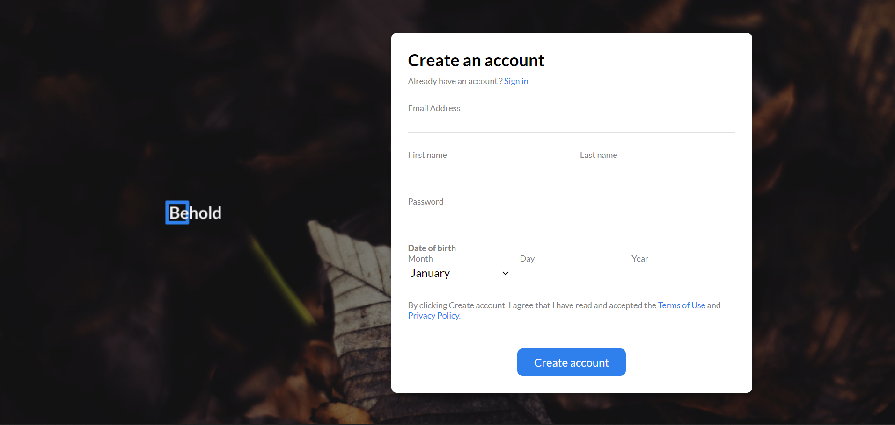

<h1 align="center">"Behold"</h1>

   Solution for a challenge from  <a href="http://devchallenges.io" target="_blank">Devchallenges.io</a>.

  <h3>
    <a href="https://maikocode.github.io/-Behold-/">
      Demo
    </a>
     | 
    <a href="https://maikocode.github.io/-Behold-/">
      Solution
    </a>
     | 
    <a href="https://devchallenges.io/challenges/0J1NxxGhOUYVqihwegfO">
      Challenge
    </a>
  </h3>

<!-- TABLE OF CONTENTS -->

## Table of Contents

- [Overview](#overview)
  - [Built With](#built-with)
- [Features](#features)
- [Contact](#contact)

<!-- OVERVIEW -->

## Overview

### Built With

-HTML && CSS

## Features

-The screen font is displayed randomly

-Animations at input level

## Contact

- GitHub [@MaikoCode](https://github.com/MaikoCode)
- Twitter [@Maikoke5](https://twitter.com/Maikoke5)

